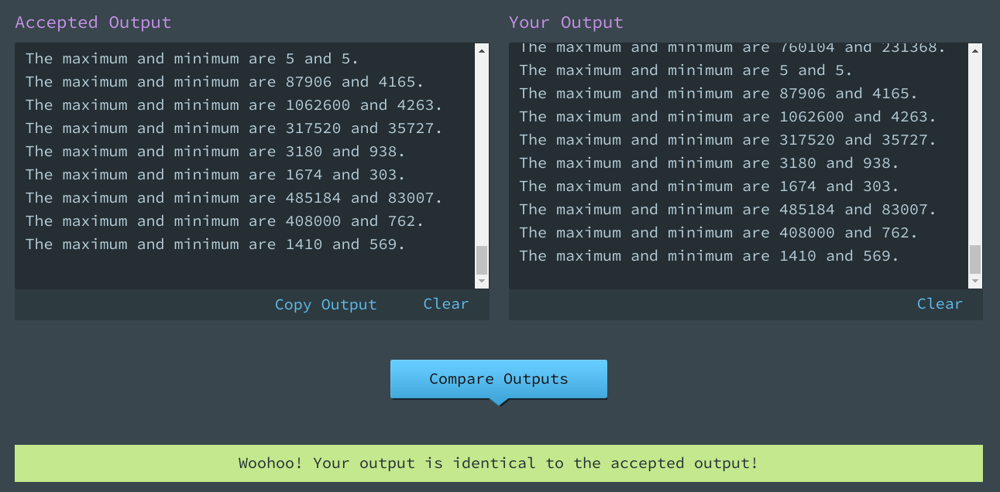
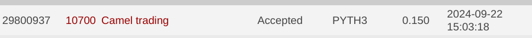

[](https://classroom.github.com/a/g_IZOH1P)
# UVA-10700 - Camel Trading
## Segunda Práctica: Algoritmos Codiciosos
Determinar el valor máximo y mínimo que se puede obtener al interpretar de diversas maneras una expresión que no tiene paréntesis y consta de sumas y restas. El enunciado lo encuentra anexo y también lo pueden consultar acá: [Online Judge - 10700 Camel trading](https://onlinejudge.org/index.php?option=com_onlinejudge&Itemid=8&category=19&page=show_problem&problem=1641).

## Correr el código
Este código lo pude correr usando en la terminal este comando:
```bash
cat input.txt | python3 main.py
```


# Documento conteniendo la explicación
[10700 Camel Trading explicación](Datos_y_algoritmos_2_Camel_trading_problem.pdf)

- PYTH3 3.5.1 - Python 3
## Evaluación

La evaluación está organizada de la siguiente manera:

20% - El programa debe pasar todos los casos de prueba de udebug Es aceptado por Udebug.

40% - El programa debe para los casos de prueba del onlinejudge de UVA -Es aceptado por UVA.

40% - La explicación de la solución utilizada y la calidad del código. [10700 Camel Trading explicación](Datos_y_algoritmos_2_Camel_trading_problem.pdf)# camel_trading
